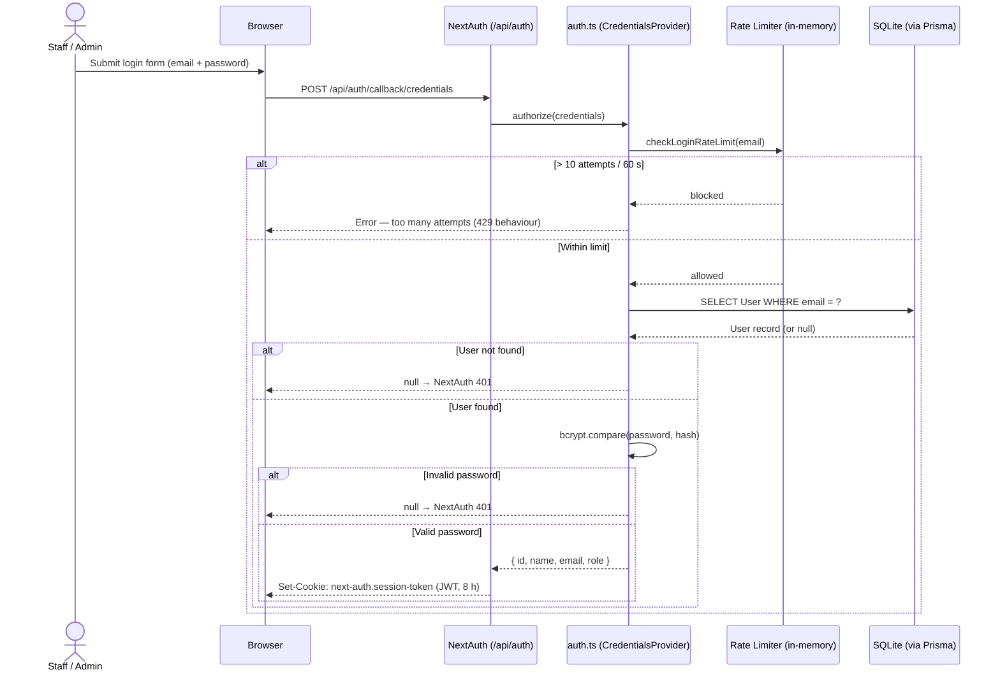
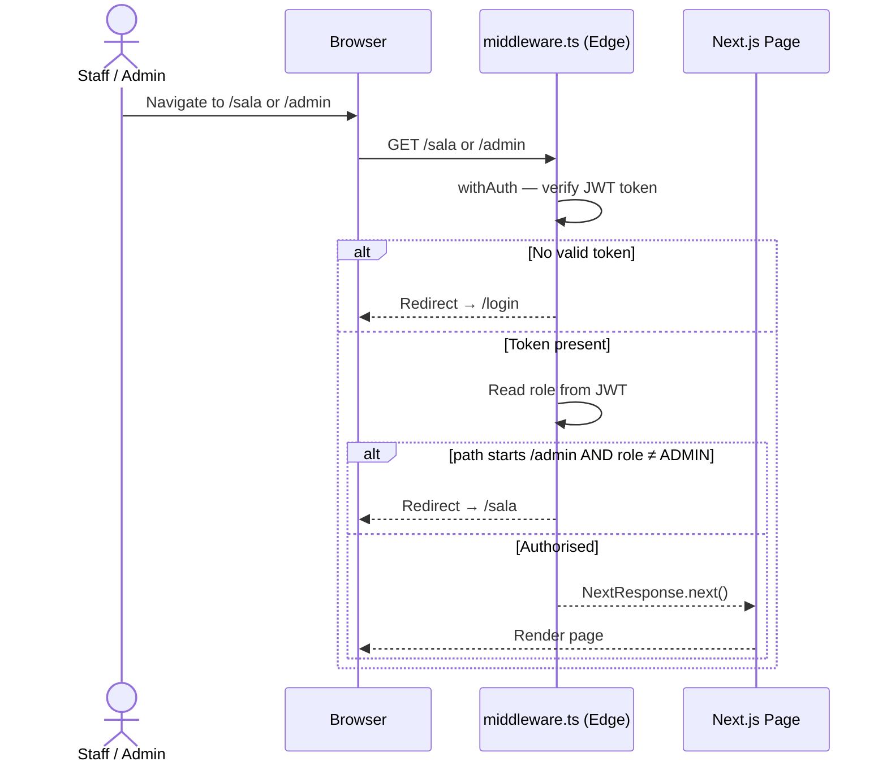
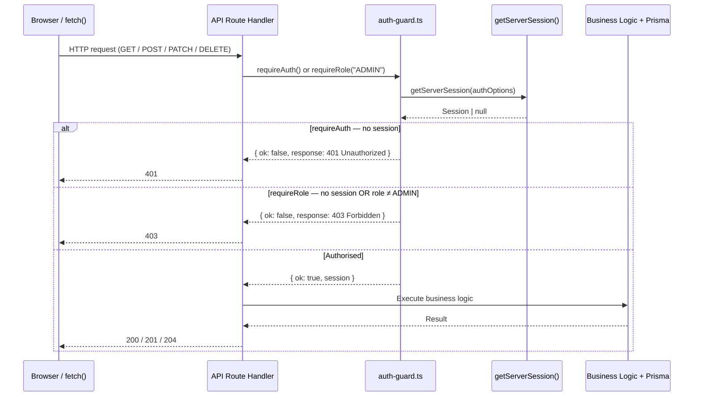

# Auth Flow — Sequence Diagram

Covers three distinct protection layers:

1. **Login** — credential verification with brute-force rate limiting (`src/lib/auth.ts`)
2. **Page protection** — JWT presence and role-based redirect (`middleware.ts`)
3. **API protection** — centralised session guard (`src/lib/auth-guard.ts`)

---

## 1 · Login Flow



---

## 2 · Page Protection (middleware.ts)



---

## 3 · API Protection (auth-guard.ts)

All API route handlers use one of two guard functions from `src/lib/auth-guard.ts`
instead of duplicating session checks inline.



> **AuthResult discriminated union:**
> ```typescript
> type AuthResult =
>   | { ok: true;  session: Session   }
>   | { ok: false; response: NextResponse }
> ```
> Routes check `if (!auth.ok) return auth.response;` — no `instanceof` fragility.
