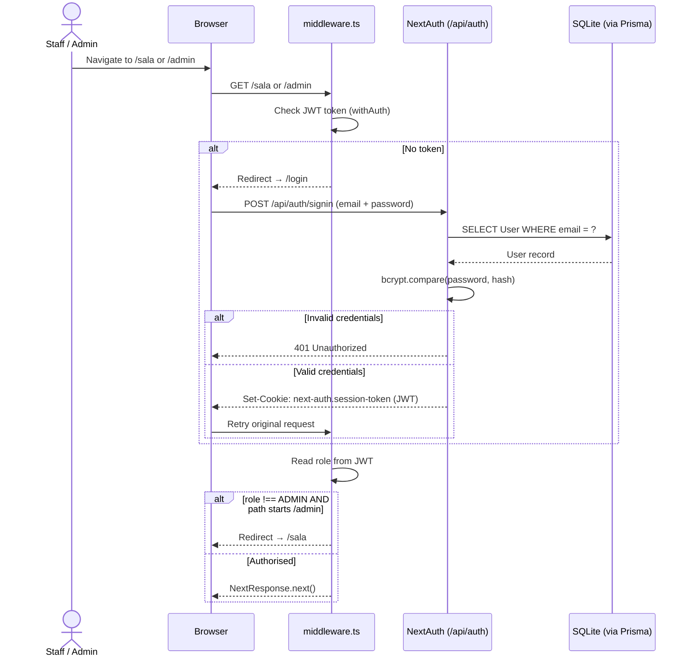

# Auth Flow — Sequence Diagram

Covers login, route protection, and role-based redirect enforced by `middleware.ts`.

```mermaid
sequenceDiagram
    actor Staff as Staff / Admin
    participant Browser
    participant Middleware as middleware.ts
    participant NextAuth as NextAuth (/api/auth)
    participant DB as SQLite (via Prisma)

    Staff->>Browser: Navigate to /sala or /admin
    Browser->>Middleware: GET /sala or /admin
    Middleware->>Middleware: Check JWT token (withAuth)
    alt No token
        Middleware-->>Browser: Redirect → /login
        Browser->>NextAuth: POST /api/auth/signin (email + password)
        NextAuth->>DB: SELECT User WHERE email = ?
        DB-->>NextAuth: User record
        NextAuth->>NextAuth: bcrypt.compare(password, hash)
        alt Invalid credentials
            NextAuth-->>Browser: 401 Unauthorized
        else Valid credentials
            NextAuth-->>Browser: Set-Cookie: next-auth.session-token (JWT)
            Browser->>Middleware: Retry original request
        end
    end

    Middleware->>Middleware: Read role from JWT
    alt role !== ADMIN AND path starts /admin
        Middleware-->>Browser: Redirect → /sala
    else Authorised
        Middleware-->>Browser: NextResponse.next()
    end
```
