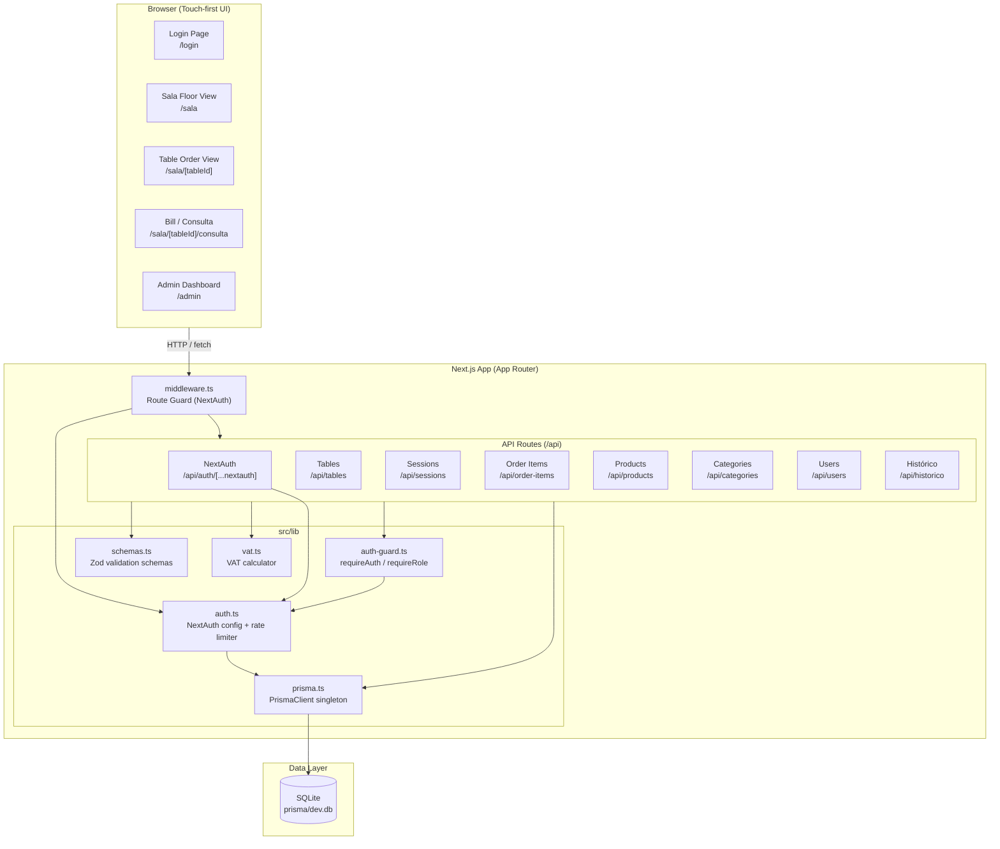

# Component Diagram

Overall architecture of the CheckMesa application within a single Docker container.

```mermaid
graph TD
    subgraph Browser["Browser (Touch-first UI)"]
        UI_Login["Login Page\n/login"]
        UI_Sala["Sala Floor View\n/sala"]
        UI_Table["Table Order View\n/sala/[tableId]"]
        UI_Consulta["Bill / Consulta\n/sala/[tableId]/consulta"]
        UI_Admin["Admin Dashboard\n/admin"]
    end

    subgraph NextJS["Next.js App (App Router)"]
        Middleware["middleware.ts\nRoute Guard (NextAuth)"]

        subgraph API["API Routes (/api)"]
            API_Auth["NextAuth\n/api/auth/[...nextauth]"]
            API_Tables["Tables\n/api/tables"]
            API_Sessions["Sessions\n/api/sessions"]
            API_OrderItems["Order Items\n/api/order-items"]
            API_Products["Products\n/api/products"]
            API_Categories["Categories\n/api/categories"]
            API_Users["Users\n/api/users"]
            API_Historico["Histórico\n/api/historico"]
        end

        subgraph Lib["src/lib"]
            Auth["auth.ts\nNextAuth config + rate limiter"]
            AuthGuard["auth-guard.ts\nrequireAuth / requireRole"]
            Schemas["schemas.ts\nZod validation schemas"]
            Prisma["prisma.ts\nPrismaClient singleton"]
            VAT["vat.ts\nVAT calculator"]
        end
    end

    subgraph Data["Data Layer"]
        SQLite[("SQLite\nprisma/dev.db")]
    end

    Browser -->|HTTP / fetch| Middleware
    Middleware --> API
    Middleware --> Auth
    API_Auth --> Auth
    Auth --> Prisma
    API --> AuthGuard
    AuthGuard --> Auth
    API --> Schemas
    API --> Prisma
    API --> VAT
    Prisma --> SQLite
```
