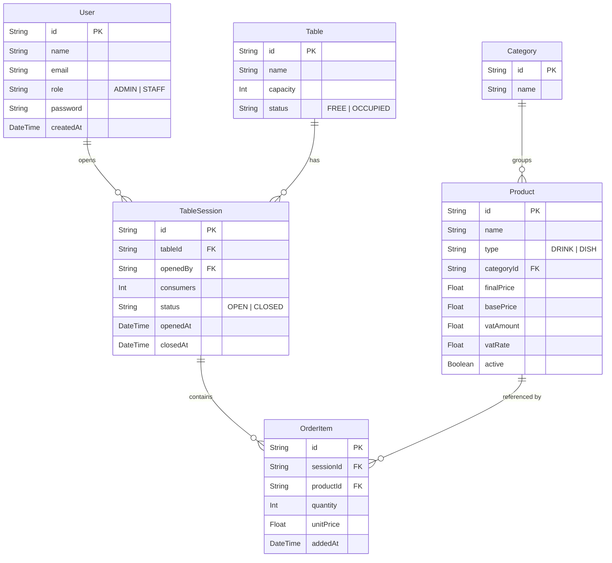

# Data Model — Entity Relationship Diagram

Derived from `prisma/schema.prisma`.

```mermaid
erDiagram
    User {
        String id PK
        String name
        String email
        String role "ADMIN | STAFF"
        String password
        DateTime createdAt
    }

    Table {
        String id PK
        String name
        Int capacity
        String status "FREE | OCCUPIED"
    }

    TableSession {
        String id PK
        String tableId FK
        String openedBy FK
        Int consumers
        String status "OPEN | CLOSED"
        DateTime openedAt
        DateTime closedAt
    }

    Category {
        String id PK
        String name
    }

    Product {
        String id PK
        String name
        String type "DRINK | DISH"
        String categoryId FK
        Float finalPrice
        Float basePrice
        Float vatAmount
        Float vatRate
        Boolean active
    }

    OrderItem {
        String id PK
        String sessionId FK
        String productId FK
        Int quantity
        Float unitPrice
        DateTime addedAt
    }

    User ||--o{ TableSession : "opens"
    Table ||--o{ TableSession : "has"
    TableSession ||--o{ OrderItem : "contains"
    Product ||--o{ OrderItem : "referenced by"
    Category ||--o{ Product : "groups"
```
