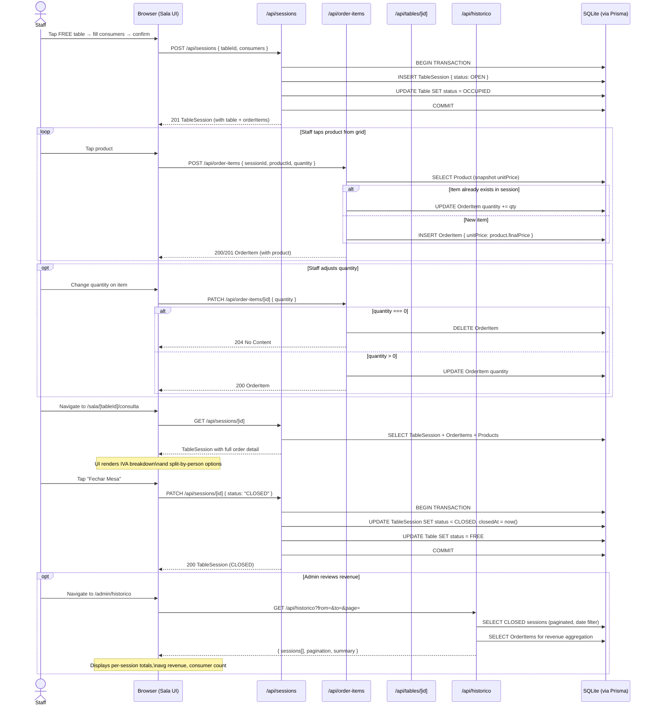

# Order Lifecycle — Sequence Diagram

Full flow from opening a table through adding/editing order items, viewing the bill, closing the session, and querying the histórico.

```mermaid
sequenceDiagram
    actor Staff
    participant UI as Browser (Sala UI)
    participant API_Sessions as /api/sessions
    participant API_Orders as /api/order-items
    participant API_Tables as /api/tables/[id]
    participant API_Historico as /api/historico
    participant DB as SQLite (via Prisma)

    %% ── 1. Open Table ─────────────────────────────────────────────
    Staff->>UI: Tap FREE table → fill consumers → confirm
    UI->>API_Sessions: POST /api/sessions { tableId, consumers }
    API_Sessions->>DB: BEGIN TRANSACTION
    API_Sessions->>DB: INSERT TableSession { status: OPEN }
    API_Sessions->>DB: UPDATE Table SET status = OCCUPIED
    API_Sessions->>DB: COMMIT
    API_Sessions-->>UI: 201 TableSession (with table + orderItems)

    %% ── 2. Add / Update Order Items ────────────────────────────────
    loop Staff taps product from grid
        Staff->>UI: Tap product
        UI->>API_Orders: POST /api/order-items { sessionId, productId, quantity }
        API_Orders->>DB: SELECT Product (snapshot unitPrice)
        alt Item already exists in session
            API_Orders->>DB: UPDATE OrderItem quantity += qty
        else New item
            API_Orders->>DB: INSERT OrderItem { unitPrice: product.finalPrice }
        end
        API_Orders-->>UI: 200/201 OrderItem (with product)
    end

    %% ── 3. Edit / Remove Item ──────────────────────────────────────
    opt Staff adjusts quantity
        Staff->>UI: Change quantity on item
        UI->>API_Orders: PATCH /api/order-items/[id] { quantity }
        alt quantity === 0
            API_Orders->>DB: DELETE OrderItem
            API_Orders-->>UI: 204 No Content
        else quantity > 0
            API_Orders->>DB: UPDATE OrderItem quantity
            API_Orders-->>UI: 200 OrderItem
        end
    end

    %% ── 4. Consulta (Bill View) ────────────────────────────────────
    Staff->>UI: Navigate to /sala/[tableId]/consulta
    UI->>API_Sessions: GET /api/sessions/[id]
    API_Sessions->>DB: SELECT TableSession + OrderItems + Products
    API_Sessions-->>UI: TableSession with full order detail
    Note over UI: UI renders IVA breakdown\nand split-by-person options

    %% ── 5. Close Session ───────────────────────────────────────────
    Staff->>UI: Tap "Fechar Mesa"
    UI->>API_Sessions: PATCH /api/sessions/[id] { status: "CLOSED" }
    API_Sessions->>DB: BEGIN TRANSACTION
    API_Sessions->>DB: UPDATE TableSession SET status = CLOSED, closedAt = now()
    API_Sessions->>DB: UPDATE Table SET status = FREE
    API_Sessions->>DB: COMMIT
    API_Sessions-->>UI: 200 TableSession (CLOSED)

    %% ── 6. Histórico (Admin only) ──────────────────────────────────
    opt Admin reviews revenue
        Staff->>UI: Navigate to /admin/historico
        UI->>API_Historico: GET /api/historico?from=&to=&page=
        API_Historico->>DB: SELECT CLOSED sessions (paginated, date filter)
        API_Historico->>DB: SELECT OrderItems for revenue aggregation
        API_Historico-->>UI: { sessions[], pagination, summary }
        Note over UI: Displays per-session totals,\navg revenue, consumer count
    end
```
