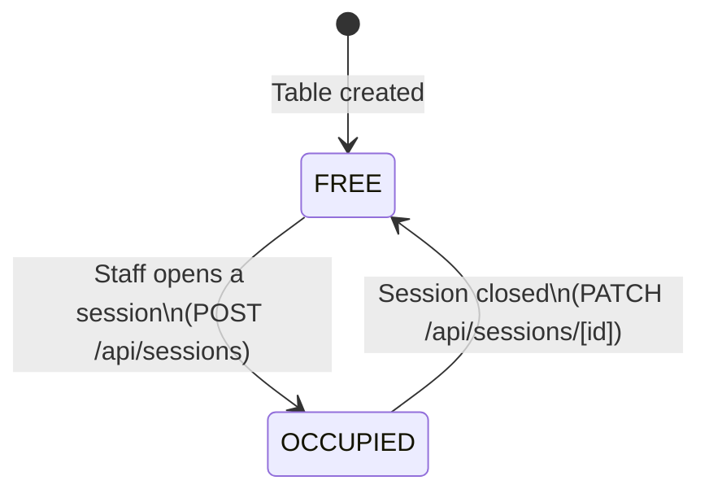
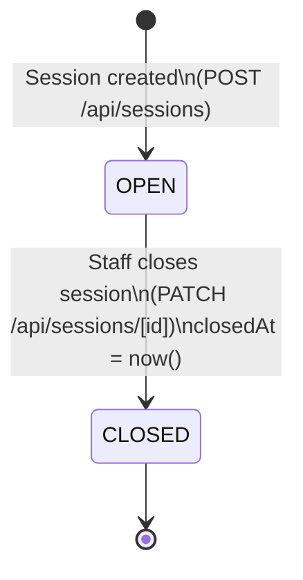

# State Machine Diagrams

## Table Status

```mermaid
stateDiagram-v2
    [*] --> FREE : Table created
    FREE --> OCCUPIED : Staff opens a session\n(POST /api/sessions)
    OCCUPIED --> FREE : Session closed\n(PATCH /api/sessions/[id])
```

## TableSession Status

```mermaid
stateDiagram-v2
    [*] --> OPEN : Session created\n(POST /api/sessions)
    OPEN --> CLOSED : Staff closes session\n(PATCH /api/sessions/[id])\nclosedAt = now()
    CLOSED --> [*]
```
